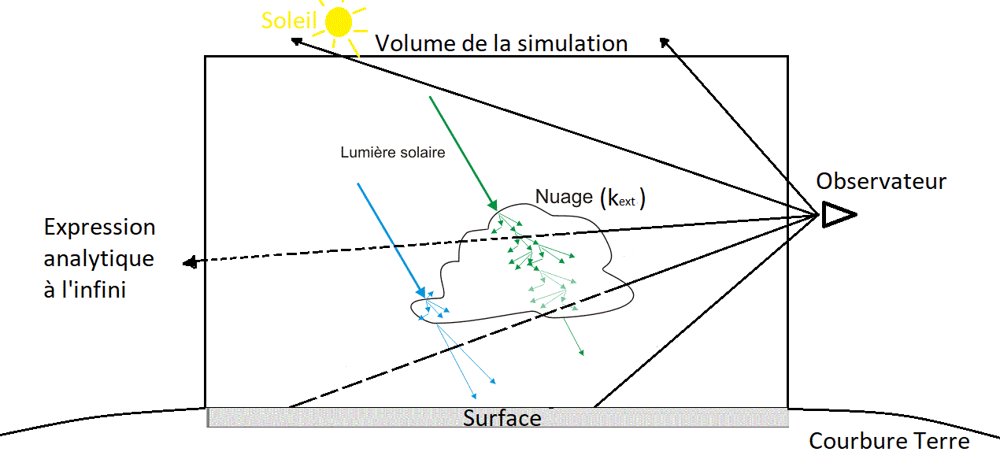

# SkyView introduction
SkyView is an interactive visualization tool for cloud simulations entirely developped in yython by Nathan Philippot.

From a 3D cloud density field, it creates an image with realistic colors by solving the Rayleigh scattering in clear sky and the mie scattering in clouds, precipitations and aerosols. You can also visualize other 3D variables, like buoyancy or wind speed, through non-realistic color emission.

This tool is made to be interactive, so the computation has to be fast enough to generate at least 10 frames per seconds. In order to reach that goal many approximations were made on the light scattering in the atmosphere, and the resolution of the generated image is decreased if necessary.

The interactivity allows you to change to move in between the clouds with mouse and keyboard controls similar to video games. This is great to visualize the complex 3D structure of clouds. And if your dataset has a good enough temporal resolution, you will be able to move in time to see the cloud dynamics.

# Video examples  #
These are direct screen captures. So the rendering is real-time at around 10fps.

  [Deep convection until sunset in Amazonia](https://drive.google.com/file/d/1nJelobFSQzIRwt9R8iHG8ormK9alGMrg/view?usp=drive_link "Google drive video")
  
  [Deep convection trigering associated with cold pools in Sahel](https://drive.google.com/file/d/1hiBYLPH4hDkfJNmti3YEQNSFoRb3EAGX/view?usp=drive_link "Google drive video")
  
  [Interactivity demonstration of position and choice of rendered variables with trade-wind cumulus flower](https://drive.google.com/file/d/1h5e0rkSSPvGsMEhlYP2hf5uhiO9LCHT8/view?usp=drive_link "Google drive video")

  [Deep convection trigering above a mountain range until sunset, at the begining thermals in red, at the end cold pools in blue](https://drive.google.com/file/d/1EDOsmpSmqoyVWB1Hgh2OatmjK7U4xti2/view?usp=drive_link)

# Python library dependencies #
Skyview is based on a minimalistic set of libraries, its code contains all the physical equations and algorithms to compute the color of each pixel. The use of numba to compile parallelized functions is necessary to acheive the intensive computation of many light rays. Pygame is used to display rapidly the generated image in a window, but also for the mouse and keyboard interactions. For the Nvidia GPU version, cupy replaces numpy to define the arrays. The joined usage of numba.cuda and cupy make the entire code very easy to translate between CPU and GPU versions.

Basic libraries | Image display and interactivity | Nvidia GPU version
| :---: | :---: | :---:
Numpy / Math / Matplotlib / Numba / Sparse | Pygame | Cupy

# Test data #
You can find [here](https://drive.google.com/drive/folders/1PQILyCeWVIgYhhGUAsEpvhwg1h40r3gw?usp=drive_link "google drive folder") the necessary data to try yourself the visualization of deep convection in Sahel.
